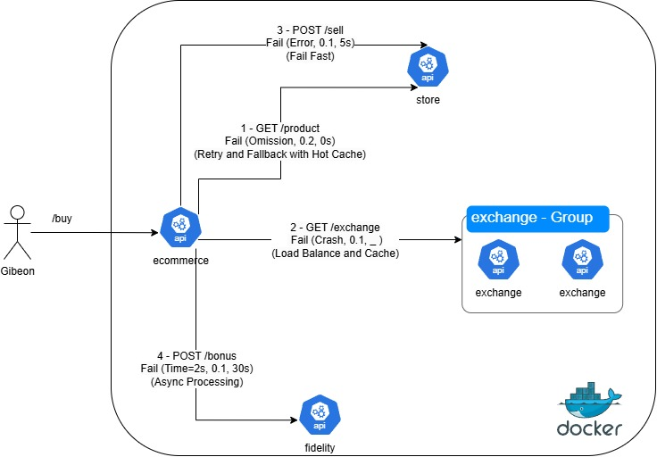

# Projeto - Tolerância a Falhas

Autores:
Márcio Tenório Júnior\
Maria Eduarda Elói Pereira

## Como Executar?

A seguir, apresentamos duas formas de executar o projeto. No entanto, para garantir a implementação completa da nossa abordagem de tolerância a falhas, é necessário executar o projeto utilizando **Docker Compose**.

### 1. Utilizando Docker Compose

Na raiz do projeto, existe um arquivo docker-compose.yml que facilita a execução de todas as APIs. Para utilizá-lo, siga os passos abaixo:

1. Certifique-se de que o Docker e o Docker Compose estão instalados na sua máquina.
2. Navegue até a pasta raiz do projeto.
3. Execute o seguinte comando no terminal:
    ```
    docker compose up -d
    ```
4. O Docker Compose cuidará de subir todas as APIs e dependências necessárias.

A API principal, **ecommerce**, estará disponível em `http://localhost:8080`, com Swagger em `http://localhost:8080/swagger-ui/index.html`.

### 2. Executando Manualmente Cada API

Caso prefira ou precise rodar as APIs separadamente, você pode executá-las manualmente. O projeto contém as seguintes APIs Spring Boot localizadas em subpastas:
- ecommerce
- exchange
- fidelity
- store

**Passos para executar:**
1. Navegue até a subpasta da API que deseja executar:
    ```
    cd <nome-da-subpasta>
    ```
2. Execute o comando abaixo para compilar e iniciar a API:
    ```
    ./mvnw spring-boot:run
    ```

## Visão Geral



## Estratégias Utilizadas

Comentários sobre as estratégias de tolerância a falhas utilizadas no serviço **ecommerce** chamando o 
exchange, store e fidelity para concluir o processo de compra.

### Estratégias Gerais

- **Timeout**: Todas as requisições realizadas pelo **ecommerce** possuem um tempo de espera (timeout) configurado de **1 segundo**. Isso garante que, caso um serviço solicitado esteja indisponível ou demore mais do que o esperado para responder, a requisição seja abortada rapidamente, evitando impactos no desempenho geral do sistema.
  
- **Restart**: Nos containers Docker, foi configurado o parâmetro `restart: always`. Isso significa que, caso algum container falhe ou seja interrompido por qualquer motivo, ele será reiniciado automaticamente. Esta estratégia ajuda a manter a disponibilidade do sistema, minimizando o tempo de inatividade.

- **Healthcheck**: Para garantir que cada serviço está funcionando corretamente, foi configurado um **healthcheck** em todos os containers do Docker Compose. Este healthcheck verifica a integridade do serviço e, caso o serviço não esteja saudável, ele será reiniciado conforme a configuração de restart mencionada.

### /product - Fail (Omission, 0.2, 0s)

Nessa rota temos a falha do tipo omissão que para a requisição atual, ela nunca é respondida.

Com base nesse conhecimento, optamos pela combinação de algumas estratégias:
- Retry - retentamos a requisição, pois a omissão pode não ocorrer no request seguinte.
- Fallback - trabalhamos com um plano "B" caso o retry não seja efetivo e continue 
não obtendo resposta.
- Hot Cache - no fallback temos um hot cache (cache inicializado com itens que aumentem o cache hit).

Assim minimizamos os problemas provenientes dessa comunicação, pois mesmo com a omissão e no pior 
dos casos teremos um dado do cache inconsistente. Porém, essa inconsistência não irá
para o banco, pois no **/sell** ele será barrado.

### /exchange - Fail (Crash, 0.1, _ )

Essa rota temos a falha do tipo crash, onde a instância atual do serviço irá parar de ser executada
e não responder o request atual.

Dada a natureza desse tipo de erro e da condição de que existiriam mais de uma instância desse
serviço, consideramos as seguintes estratégias:
- Load balancing - um round-robin nas instâncias para distribuição de carga e diminuir a necessidade
de configuração para novas instâncias.
- Cache - Caso todas as instâncias caiam trabalhamos com a última cotação registrada, pois
normalmente em pouco tempo (horas) o câmbio não poderia variar para gerar percas tão 
significativas em detrimento da concretização da venda.

Desta forma os containers se comportam como uma unidade aumentando a disponibilidade e o cache
é a segurança caso o container chamado não consiga responder.

### /sell - Fail (Error, 0.1, 5s)

Nessa chamada identificamos que o erro simulado ultrapassa o limite fornecido de 1s
como espera para completar o processo de compra. Assim, caso o erro ocorra é inviável qualquer 
outra abordagem.

Nesse caso optamos por usar apenas o **fail fast** para não degradar possíveis downstreams e 
aumentar a responsividade do upstream.

### /bonus - Fail (Time=2s, 0.1, 30s)

Nessa chamada como comentamos em sala, não é um fluxo essencial para a venda. Assim em caso de falha
é possível acontecer um processamento assíncrono dessa contagem de pontos para o cliente sem prejuízo
de negócio.

Aqui isolamos a chamada para o fidelity e caso não fosse possível executar a adição dos pontos
chamando o serviço utilizamos:
- Log - para salvar no ecommerce o bonus a ser creditado em caso de falha

Dessa forma cumprimos o tempo máximo de espera de 1s em caso de problema no fidelity e
controlamos retentivas até de fato conseguir concretizar o bônus.

## Onde E Como Foram Implementadas?

A implementação foi realizada utilizando **Java 23**, **Spring Boot** e **Resilience4j**. A seguir, detalhamos os principais pontos de implementação:

- [/product](ecommerce/src/main/java/com/ecommerce/service/ProductService.java) - 
Aqui foi simulado um Hot Cache com um array, mas em um cenário real poderia usar um redis 
com a mesma ideia de ser inicializado com os produtos mais pesquisados.
- [/exchange](ecommerce/src/main/java/com/ecommerce/service/BuyService.java#L63-L64) - Aqui foi implementada a tentativa de **obter o cache local** do último valor de conversão do câmbio.
- [/sell](ecommerce/src/main/java/com/ecommerce/service/BuyService.java#L70-L71) - Aqui foi utilizado o **Circuit Breaker** para gerenciar falhas na requisição de venda. Caso ocorra um erro, o sistema falha rapidamente, evitando que requisições subsequentes sobrecarreguem o sistema.
- [/bonus](ecommerce/src/main/java/com/ecommerce/jobs/RetryRequestBonusJob.java) - Aqui foi criada uma **tarefa agendada** para processar as requisições de aplicação do bônus que falharam.

## Limitações

Apesar das estratégias de tolerância a falhas implementadas, existem algumas limitações que precisam ser consideradas para garantir um funcionamento adequado do sistema:

- **Inconsistência de Dados no Cache**: O produto pode ficar defasado se a requisição para obter o produto por ID no serviço **store** falhar e o sistema utilizar os dados do cache por um longo período. Isso pode gerar inconsistência entre os dados em cache e o banco de dados real. O mesmo problema ocorre no serviço **exchange**, onde a conversão de câmbio pode ser baseada em dados desatualizados se a requisição à API de câmbio falhar e o cache for utilizado. Também, é necessário implementar uma estratégia de invalidação ou expiração do cache para evitar manter os dados em cache (desatualizados) indefinidamente.

- **Acúmulo de Processamento no Fidelity**: O **serviço de fidelity** pode acumular um grande volume de processamento durante o intervalo de 30 segundos de downtime, caso uma requisição falhe e precise ser reprocessada. Para evitar sobrecarga, seria necessário ajustar a frequência ou lógica de retry, ou considerar dividir o processamento de maneira mais eficiente.

- **Cuidado com o Retry**: A estratégia de **retry** deve ser usada com cautela para evitar sobrecarregar o serviço de destino. Muitos retries seguidos em caso de falhas podem resultar em um estresse significativo para o serviço chamado, especialmente se ele estiver sobrecarregado ou instável.

- **Falhas no Fail Fast do /sell**: O endpoint **/sell** utiliza a abordagem de **fail fast**, o que pode resultar em muitas falhas se o serviço de destino estiver temporariamente indisponível. Embora isso ajude a evitar a sobrecarga, é necessário equilibrar essa estratégia para não afetar a experiência do usuário, implementando uma redundância com mecanismo de retry ou fallback para a instância disponível.

- **Problemas com o Load Balancing**: O **load balancing** está configurado com a estratégia **round-robin**, o que pode fazer com que o tráfego seja direcionado para instâncias que estão inativas ou falharam. Para mitigar isso, seria necessário configurar um **healthcheck** adequado no load balancer para garantir que apenas instâncias saudáveis recebam requisições.

## Abordagens Alternativas

- **Cache Distribuído em vez de Hot Cache Simulado**: 
  - **Solução Atual**: Utilizamos um array para simular um **Hot Cache** de produtos. 
  - **Abordagem Alternativa**: Em vez de usar um cache simples na memória, poderia ser adotado um **cache distribuído**, como o **Redis**, para armazenar os produtos mais acessados. Isso garantiria alta disponibilidade e escalabilidade, já que o Redis pode ser configurado para persistir dados entre reinicializações e ser compartilhado entre múltiplos serviços.

- **Utilização de Filas para Processamento Assíncrono no Fidelity**:
  - **Solução Atual**: Temos uma tarefa agendada para executar aplicações de bônus que falharam, e pode acumular bastante carga durante o downtime do **fidelity**. 
  - **Abordagem Alternativa**: Uma alternativa seria utilizar **filas de mensagens** (como RabbitMQ ou Kafka) para realizar o processamento de forma desacoplada.

- **Configuração de Load Balancer com Healthcheck Avançado**:
  - **Solução Atual**: O balanceador de carga utiliza **round-robin** para distribuir o tráfego.
  - **Abordagem Alternativa**: Uma abordagem mais robusta seria configurar o **load balancer** com um **healthcheck avançado**, que verifica a disponibilidade das instâncias, a performance e a carga das mesmas. Isso garantiria que o tráfego fosse direcionado apenas para instâncias que estivessem ativas e operando dentro dos parâmetros de desempenho esperados.

## Vídeo

[Vídeo no Youtube](https://youtu.be/5FnmNiePDaQ)


## Testes - Desempenho e Disponibilidade - WIP

## TODO
- Definir cenários, stages e ver vazão que a aplicação suporta (10, 1000, 10000, etc)
- Ver se consegue rodar todos os cenários juntos

### Descrição Sobre o Sistema - Ja ta feito
Caso seja possível, descreva a arquitetura
do sistema e as tecnologias utilizadas (linguagem de programação, banco de dados,
etc.)

### Cenários

Pensei em
- "Happy Path" com tudo up
- Exchange(somente uma instância) e Fidelity off

### Planejamento dos Testes

- Execute pelo menos 2 tipos de testes de desempenho diferentes (Ver material
das Aulas de Desempenho e Disponibilidade)
- Descreva as métricas de Desempenho que serão analisadas e como elas serão
calculadas
- Descreva as métricas de Disponibilidade que serão analisadas e como elas
serão calculadas

### Resultados da Análise

- Informações do ambiente de execução
- Apresentação dos valores das medições para os diferentes tipos de testes
- Interpretação dos resultados